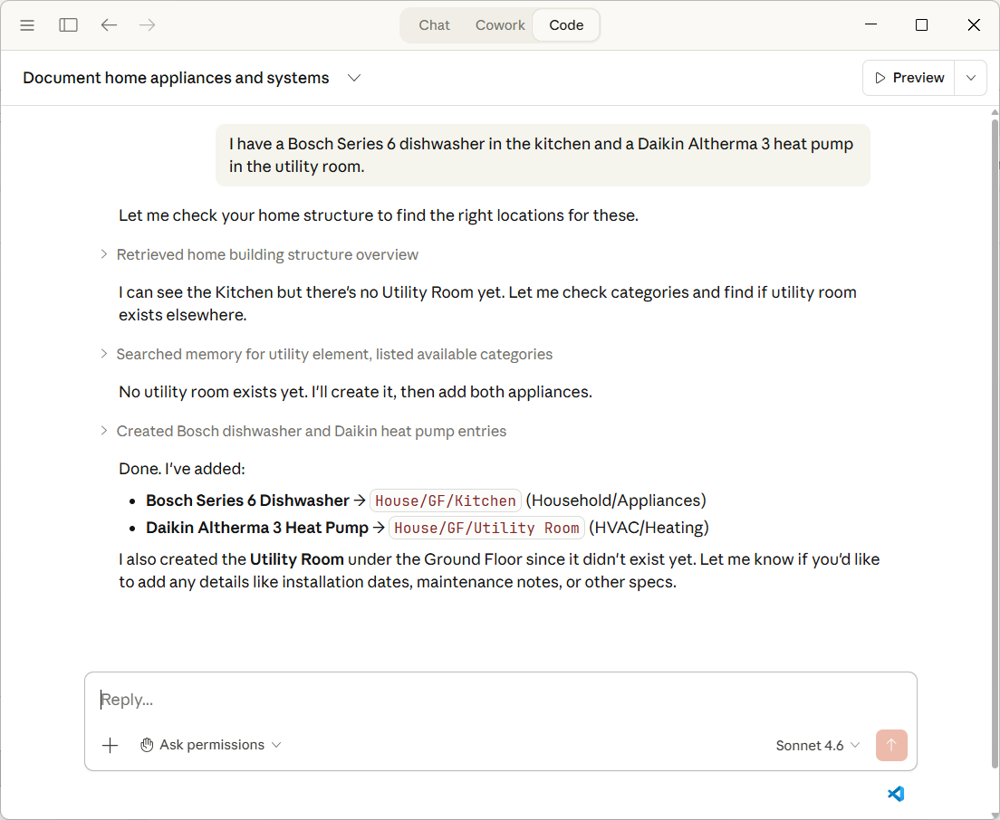
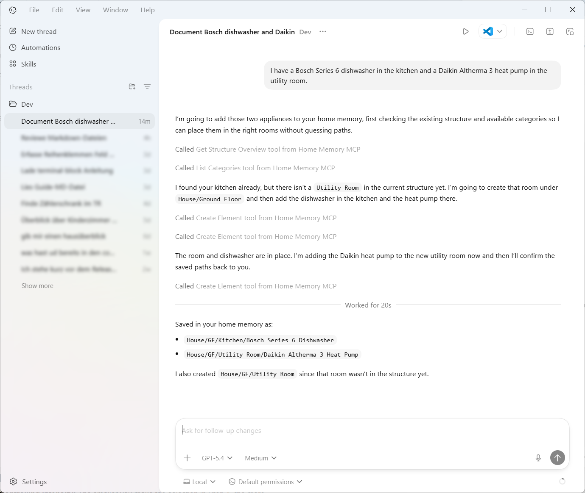

<p align="center">
  <h1 align="center">Home Memory</h1>
  <p align="center"><strong>Ask your home.</strong></p>
  <p align="center">Your AI assistant's memory for everything in and around your home.</p>
</p>

<p align="center">
  <a href="LICENSE"></a>
  
  
</p>

---

Home Memory is an [MCP server](https://modelcontextprotocol.io/) that gives your AI assistant structured, persistent knowledge about your home — every room, every device, every pipe and cable, every item you own. It plugs into Claude, OpenAI Codex, or any MCP-compatible AI and turns natural conversation into a living, queryable documentation of your home and everything in it.

No app to learn. No forms to fill out. Your home data stays in a single file on your machine — the AI *is* your interface.

Tell your AI about your heat pump, your car, your power tools, or your wine collection — it extracts the relevant details and stores them as structured data in your local database. Snap a photo of a device or hand it an invoice — same thing. Ask "What's in the basement?" or "When is my car due for inspection?" and get real answers from real data, not hallucinations.

<p align="center">
  
  <br>
  <em>Claude Desktop (Anthropic)</em>
</p>

<p align="center">
  
  <br>
  <em>Codex App (OpenAI)</em>
</p>

## What you can do

**Document anything by just talking:**
> "I have a Daikin Altherma heat pump in the utility room."

Your AI finds the right category, resolves the location, and creates the element — no manual data entry.

> "My car is a 2023 Toyota Corolla Hybrid — next inspection is due in March."

Not just building infrastructure — vehicles, tools, appliances, valuables, anything that belongs to you.

**Ask questions about your home:**
> "What's in the basement?" &middot; "Show me all planned purchases." &middot; "Where is my washing machine?"

**Upload a photo and let your AI identify it:**
> *(attach a photo of a device)* "What is this? Add it to the utility room."

Vision-capable AIs recognize the device and create the element via MCP.

**Read an invoice and extract devices:**
> *(attach a PDF invoice)* "Extract the installed devices and add them to my home."

**Track connections between elements:**
> "The circuit breaker panel feeds the kitchen outlet via NYM-J 3x1.5."

Cable routes, pipe runs, duct paths — documented as connections between elements.

**Plan renovations:**
> "We're planning a PV system on the roof." &middot; "The old oil heater was removed last year."

Track what's planned, what exists, and what's been removed.

## Quick Start (Windows)

The release ZIP is self-contained — no .NET, no Firebird, no other software to install.

### 1. Download & Extract

1. Download the latest release ZIP from [GitHub Releases](../../releases)
2. Extract to a folder, e.g. `C:\HomeMemory\`

### 2. Connect to your AI

Choose **one** of the following clients:

<details>
<summary><strong>Codex App (OpenAI)</strong></summary>

1. Open the Codex App
2. Click **File > Settings**, then select **MCP servers** on the left
3. Click **+ Add server**
4. **Name:** `home-memory`
5. **Command to launch:** `C:\HomeMemory\HomeMemoryMCP.exe`
6. Leave transport on **STDIO** (default)
7. Click **Save** — restart the app if needed

Or via Codex CLI:
```bash
codex mcp add home-memory -- "C:\HomeMemory\HomeMemoryMCP.exe"
```

</details>

<details>
<summary><strong>Claude Desktop</strong></summary>

1. Open Claude Desktop
2. Click the **Claude menu** → **Settings** → **Developer** → **Edit Config**
3. Add the `home-memory` entry inside `mcpServers` (keep any existing entries):

```json
"home-memory": {
  "command": "C:\\HomeMemory\\HomeMemoryMCP.exe"
}
```

4. Save the file and restart Claude Desktop

Home Memory is available in the Chat tab.

> If you register Home Memory via Claude Code (`claude mcp add`), it may also appear in the Code tab. Avoid defining the same server in both places, as the Desktop configuration can override the Code tab in some versions.

</details>

<details>
<summary><strong>Claude Code (CLI)</strong></summary>

```bash
claude mcp add home-memory --scope user -- "C:\HomeMemory\HomeMemoryMCP.exe"
```

</details>

### 3. Try it

On first launch, Home Memory automatically creates a local database with over 100 categories and a default house structure (floors, rooms, garage, outdoor areas). No setup wizard needed.

**Try these prompts in order:**

> "Show me the structure of my home."

You should see your default house structure: ground floor, upper floor, basement, each with rooms. This confirms everything is working.

> "I have a Bosch washing machine in the basement."

Your AI creates the element, finds the right category, and places it in the basement — all in one step. Ask "What's in the basement?" to verify.

> "We're planning to install a heat pump in the utility room."

Creates a planned element — so you can track what exists and what's coming.

**If it works, you're done.** Everything from here is just talking to your AI. Add rooms, rename floors, document your electrical panel, upload a photo of a device — the AI handles the rest.

### Build from Source (advanced)

Requires [.NET 10 SDK](https://dotnet.microsoft.com/download/dotnet/10.0) and [Firebird 3.0](https://firebirdsql.org/en/firebird-3-0/).

```bash
git clone https://github.com/impactjo/home-memory.git
cd home-memory
dotnet publish HomeMemoryMCP -c Release
```

See [Setup Guide](docs/SETUP-GUIDE.md) for details on Firebird configuration and environment variables.

## How it works

```
You ──── AI Assistant ──── Home Memory MCP ──── Local Database
              (natural language)      (22 tools)       (Firebird Embedded)
```

Home Memory implements the [Model Context Protocol (MCP)](https://modelcontextprotocol.io/), an open standard that lets AI assistants use external tools. When you talk to your AI about your home, it calls Home Memory's tools behind the scenes — reading, creating, updating, and searching your home data.

**Your data stays local.** The database is a single file on your machine. Nothing is sent anywhere except to the AI you're already talking to.

## Features

### 22 MCP Tools

| | Tools | What they do |
|---|---|---|
| **Explore** | `get_structure_overview`, `find_element`, `list_elements`, `get_element_details` | Browse your home, search by name/path/status, get full details |
| **Manage Elements** | `create_element`, `update_element`, `delete_element`, `move_element` | Add devices, furniture, fixtures — or entire rooms and floors |
| **Connections** | `get_connections`, `get_connection_details`, `create_connection`, `update_connection`, `delete_connection` | Document physical lines: cables, pipes, ducts, conduits |
| **Categories** | `list_categories`, `get_by_category`, `create_category`, `update_category`, `delete_category` | Over 100 built-in categories across all domains |
| **Status** | `list_statuses`, `create_status`, `update_status`, `delete_status` | Track what's existing, planned, or removed |

### Covers every domain

Electrical (circuits, PV, wallbox, home automation) &middot; HVAC &middot; Plumbing &middot; IT & Communications &middot; Security (alarm, fire, surveillance) &middot; Building Materials &middot; Landscaping (garden, pool, irrigation) &middot; Household (appliances, furniture, valuables) &middot; Vehicles &middot; Tools &middot; Health &middot; Sports & Leisure

### Smart defaults

- **Over 100 categories** organized by trade and domain — from circuit breakers to garden sprinklers to vehicles
- **Default house structure** with floors, rooms, garage, and outdoor areas — customize by talking to your AI
- **Auto-setup** on first run — no manual database creation needed
- **Flexible naming** — your AI can use "Ground Floor" or "GF", the server resolves both

## Compatibility

| Client | Status |
|---|---|
| Codex App (OpenAI) | Tested, production-ready |
| Claude Desktop (Chat tab) | Tested, production-ready |
| Claude Desktop (Code tab) | Works via Claude Code registration; see note above |
| Claude Code (CLI) | Tested, production-ready |
| Codex CLI (OpenAI) | Tested, production-ready |
| Any MCP-compatible client | Should work (stdio transport) |

The release ZIP is a self-contained Windows build with all dependencies included (no .NET or Firebird installation required). On macOS and Linux, you can build from source with .NET 10 and Firebird 3 — see the [Setup Guide](docs/SETUP-GUIDE.md) for details.

## Configuration

| Environment Variable | Purpose | Default |
|---|---|---|
| `HOME_MEMORY_DB_PATH` | Database file location | `%LOCALAPPDATA%\HomeMemory\homememory.scd` (Windows) · `~/.local/share/HomeMemory/homememory.scd` (Linux) · `~/Library/Application Support/HomeMemory/homememory.scd` (macOS) |
| `HOME_MEMORY_FBCLIENT` | Path to Firebird client library | Bundled with release / Firebird installation |

## Architecture

- **.NET 10** with [ModelContextProtocol SDK](https://github.com/modelcontextprotocol/csharp-sdk)
- **Firebird Embedded** — zero-install database engine, single-file storage
- **Raw SQL** with recursive CTEs — no ORM overhead, transparent and auditable

## Contributing

Home Memory is in its early stages and we'd love to hear from you! Right now, the best way to contribute is:

- **Open an issue** for bug reports, feature ideas, or questions
- **Share your use case** — how are you using Home Memory? What's missing?
- **Spread the word** if you find it useful

We're not accepting code contributions at this point. If you'd like to build and explore the code locally, see the [Setup Guide](docs/SETUP-GUIDE.md).

## Background

Home Memory builds on a proven data model from [Smartconstruct](https://smartconstruct.io), a desktop application for documenting physical assets — refined through real-world use in residential construction projects.

## License

[AGPL-3.0](LICENSE)

For commercial licensing options, please [open an issue](../../issues).
